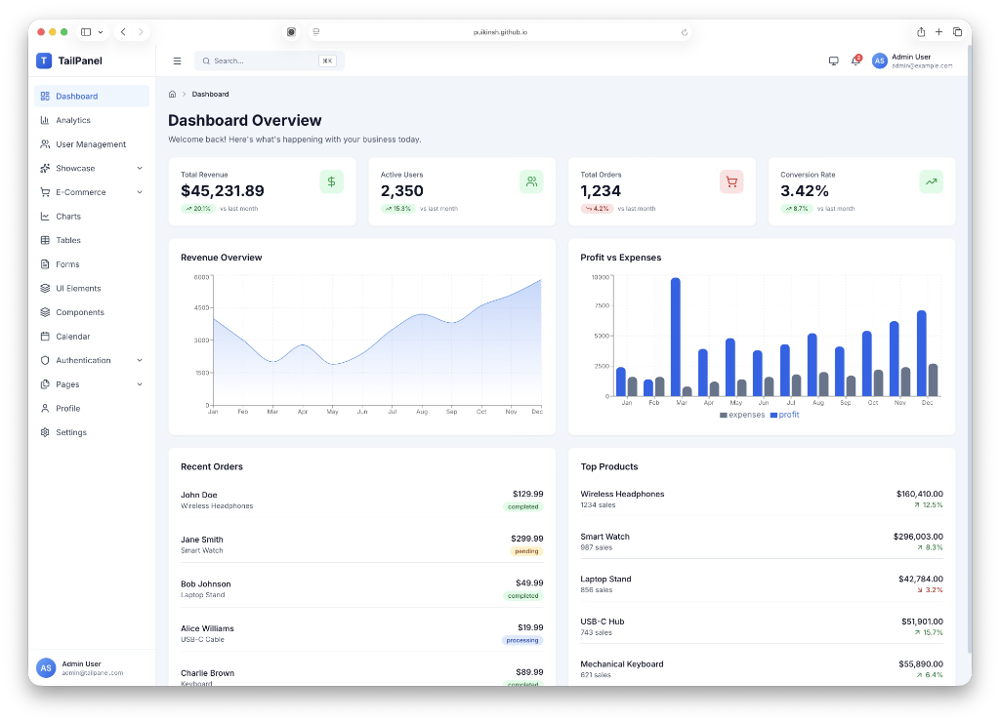

# Jawad Ahmed - Portfolio



A modern, responsive personal portfolio website built with **React** and **Tailwind CSS**. It showcases my projects, skills, and experience as a Full Stack Developer & AI Engineer.

## 🚀 Live Demo
[Insert your live link here, e.g., https://jawad-portfolio.vercel.app]

## ✨ Features
- **Responsive Design:** Fully optimized for all devices (Mobile, Tablet, Desktop).
- **Dark Mode:** Seamless light/dark theme toggle.
- **Interactive UI:** Smooth animations using `Framer Motion`.
- **Working Contact Form:** Integrated with **EmailJS** for instant email delivery.
- **Dynamic Projects:** Easy-to-update project data structure.

## 🛠️ Tech Stack
- **Frontend:** React.js, Tailwind CSS
- **Animations:** Framer Motion
- **Icons:** Lucide React
- **Routing:** React Router DOM
- **Form Handling:** EmailJS
- **Build Tool:** Vite

## 📦 Installation
1.  **Clone the repository:**
    ```bash
    git clone https://github.com/JawadAhmed-Pro/portfolio.git
    cd portfolio
    ```

2.  **Install dependencies:**
    ```bash
    npm install
    ```

3.  **Run the development server:**
    ```bash
    npm run dev
    ```

## 🚀 Deployment
This project is optimized for deployment on **Vercel** or **Netlify**.

### Deploy on Vercel (Recommended)
1.  Push your code to **GitHub**.
2.  Go to [Vercel](https://vercel.com/) and sign up.
3.  Click **Add New > Project** and select this repository.
4.  Click **Deploy**.

## 📄 License
This project is open source and available under the [MIT License](LICENSE).

---
© 2026 Jawad Ahmed. All Rights Reserved.
